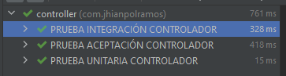

# Spring Boot Pirámide de prueba

Este proyecto incluye pruebas de Unidad, Integración y Aceptación para un controlador Spring Boot REST simple.
El objetivo de esto era ver cómo escribir cada tipo de prueba en Spring y ver las ventajas/desventajas de cada uno.

## Pruebas unitarias
Prueba de pieza de código individual.

## Pruebas de integración
Probar la integración de unidades juntas.

## Prueba de aceptacion
Probar la aplicación funciona de la forma en que el usuario espera que lo haga. Esto puede validar los requisitos comerciales.

## Ejecutando localmente
mvn spring-boot:run

## Probando localmente
mvn test
